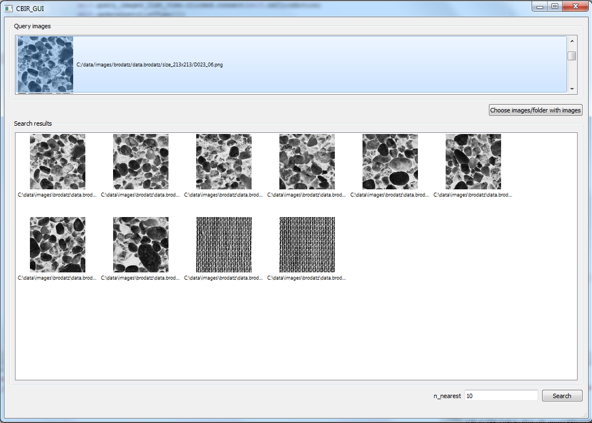

# cbir_framework

Framework represents CBIR as several steps:
- Transformation (computing descriptors, any array manipultaions)
- Sampling (frequent step before quantization)
- Quantization
- Search
- Search evaluation, plotting

All steps (except plotting) are designed in flavour of pipeline:
each step has input data store and output data store and in transformation step you can even imitate real pipeline
chaining transformers.

To add new type of descriptor you need add your <transformer.py> which must implement method like 'transform_item', then you can easily pass it to
transformation step and compute descriptors of new type you need.

Similar situtaion with data stores. There are already implementations like SQLiteDataStore, CSVFileDataStore, NumpyDataStore.
You can add your <data_store.py> which must implement several methods like 'get_items_sorted_by_ids' and then pass it to
any step in your cbir pipeline.

(Note that there is considerable mess with way of getting data, processing and saving it. There were intentions to process data in
stream-like style, but its has led to unpleasant restrictions and time-perfomance issues.)

Framework depends on python modules in [inverted_multi_index prjoect](https://github.com/DIMAthe47/inverted_multi_index).
It utilizes them for fast (I hope) vector operations, building inverted multi-index, perfoming inverted multi-index search,
exhaustive search with SDC and ADC distance computations.

Here goes major steps and examples of them.

# Descriptors computation
* <a name="global_descriptors">global descriptors</a>
    * [compute from image](/examples/notebooks/descriptors_computation/compute_global_descriptors_from_image.ipynb)
    * [compute from local descriptors (sift set -> BOVW)](/examples/notebooks/descriptors_computation/compute_global_descriptors_from_local_descriptors.ipynb)
* local descriptors
    * [compute from image](/examples/notebooks/descriptors_computation/compute_local_descriptors_from_image.ipynb)

# Quantization
* finding <a name="centroids">[centroids](/examples/notebooks/quantization/finding_centroids.ipynb)</a>
* quantizing global descriptors to <a name="pq_codes">[pq codes](/examples/notebooks/quantization/quantize_global_descriptors_to_pqcodes.ipynb)</a>
* finding <a name="centroids_pairwise_distances">[centroids pairwise distances](/examples/notebooks/quantization/compute_centroids_pairwise_distances.ipynb)</a>

# Sampling
It`s often enough to quantize only sample from descriptors.

[Example (sampling sifts)->](/examples/notebooks/sampling.ipynb).

# Search
4 types of search are supported:
* [exhaustive](/examples/notebooks/searching/exhaustive_search.ipynb)
* [sdc exhaustive](/examples/notebooks/searching/sdc_exhaustive_search.ipynb)
* [adc exhaustive](/examples/notebooks/searching/adc_exhaustive_search.ipynb)
* [inverted multi-index](/examples/notebooks/searching/inverted_multi_index_search.ipynb)

### Exhaustive search
requires:
- [global descriptors](#global_descriptors)

### SDC exhaustive search
requires:
- [centroids](#centroids)
- [pq codes](#pq_codes)
- [centroids pairwise distances](#centroids_pairwise_distances)

### ADC exhaustive search
requires:
- [centroids](#centroids)
- [pq codes](#pq_codes)

### Inverted multi-index search
requires:
- [centroids](#centroids)
- [pq codes](#pq_codes)

# Evaluation
Step to evaluate search perfomance.

[Example](/examples/notebooks/evaluate_search.ipynb).

# Plotting
* compare descriptors for exhaustive search [Example->](/examples/notebooks/plotting/plot_exhaustive_search_perfomance_n_nearest.ipynb)
* compare memory for descriptors for exhaustive search [Example->](/examples/notebooks/plotting/plot_exhaustive_search_perfomance_memory.ipynb)
* compare quantization parameters for pq search techniques(adc, sdc, imi) [Example->](/examples/notebooks/plotting/plot_search_perfomance_pq_params.ipynb)
* compare pq search types(adc, sdc, imi) [Example->](/examples/notebooks/plotting/plot_search_perfomance_search_types.ipynb)

___

# UI

For UI of finding images by example, client-server architecture was implemented. Server needs to be configurated with one of "searcher" (like in examples), then he listens to requests on localhost. Client with GUI connects to server on startup, can choose images in filesystem, and then search for most similar images. (Here file pathes are transmitted to server, because all communication is on one machine, but its not difficult to change it to send/receive image bytes). When server recieves request for search, it searches using searcher it was configurated and send back to client file pathes to nearest images.

